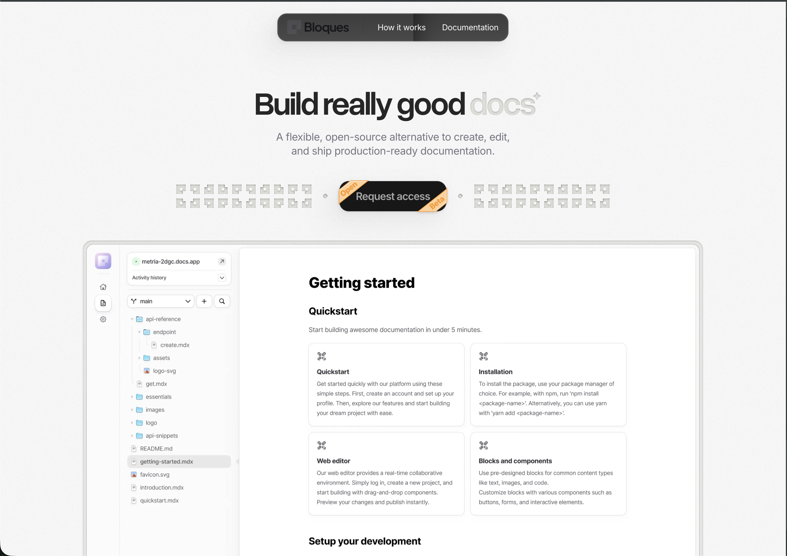

This page walks through t urning the starter into your own docs site.

## Prerequisites

- A GitHub account.
- A [Bloques](https://bloques.app) account.

## Set up your site

<Steps>
  <Step title="Create a repo from the template" icon="branch">
    From the starter repo on GitHub, select **Use this template** and create a
    new repository under your account or organization.
  </Step>

  <Step title="Connect Bloques" icon="rocket">
    Sign in to Bloques, create a site, and connect your new repository. Pick the
    branch to publish from — every push to that branch redeploys the site.
  </Step>

  <Step title="Edit content" icon="pencil">
    Edit pages in the Bloques editor in your browser, or edit `.mdx` files
    directly on GitHub. Saved changes commit to your repo and trigger a deploy.
  </Step>
</Steps>

<Callout type="info">
  The first deploy starts as soon as the repository is connected. The build
  takes about a minute.
</Callout>

## Make it yours

Pages live as `.mdx` files at the root of the repo. The `docs.json` file controls the site name, navigation, and theme.

<Steps>
  <Step title="Rename the site" icon="default">
    Open `docs.json` and update `name` and `description`.
  </Step>

  <Step title="Replace the pages" icon="default">
    Edit `index.mdx`, `quickstart.mdx`, and the files under `essentials/` and
    `configuration/` with your own content.
  </Step>

  <Step title="Update the navigation" icon="default">
    Edit the `navigation` array in `docs.json` to match your page structure. See
    [Navigation](/configuration/navigation).
  </Step>

  <Step title="Set the theme" icon="default">
    Pick a preset and an optional primary color in the `theme` block. See
    [Theme](/configuration/theme).
  </Step>
</Steps>

## Next

<Columns cols="2">
  <Card title="Writing" href="/essentials/writing" cta="" icon="pencil" iconColor="gray" />

  <Card title="Components" href="/essentials/components" cta="" icon="component" iconColor="gray" />
</Columns>